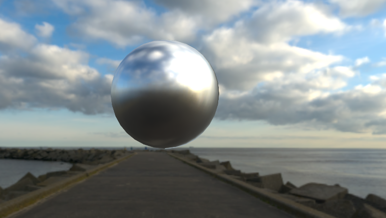
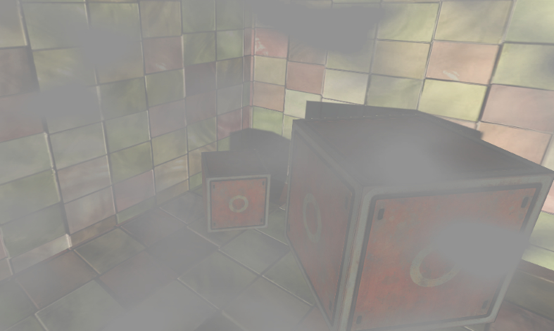

# 个人向练习时长两年半的Shader Library
包含个人对Unity Shader的制作学习，它的前身是Unity Shader入门精要一书的学习仓库。
# 示例
- PBR & IBL

  

- 后处理 & 标准着色

  
# References
- [Shader入门精要](https://github.com/candycat1992/Unity_Shaders_Book)
- [毛星云老师游戏开发编程知乎专栏](https://www.zhihu.com/column/game-programming)
- [Games101](https://www.bilibili.com/video/BV1X7411F744/?p=15&vd_source=80dfe42ae16a11fb93eda40958202849)
